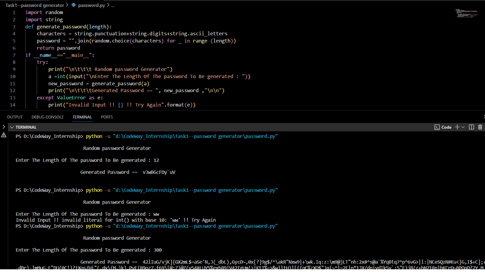
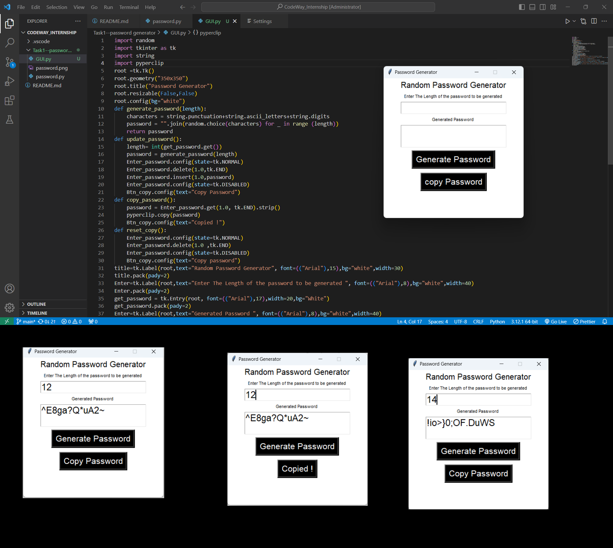

# Task 1 Completed 

> "The only limit to our realization of tomorrow will be our doubts of today." - Franklin D. Roosevelt

## Description

- ### A password generator
        It is a useful tool that generates strong and random passwords for users. This project aims to create a password generator application using Python, allowing users to specify the length and complexity of the password.
- **User Input :**
    Prompt the user to specify the desired length of the password.
- **Generate Password:**
    Use a combination of random characters to generate a password of the specified length.
- **Display the Password:**
    Print the generated password on the screen.


## Features

- **Customization:** Specify the length and complexity of your password.
- **CLI and GUI:** Choose between a command-line interface or a user-friendly graphical interface.
- **Secure:** Generates passwords with a mix of punctuation, letters, and digits for increased security.
- **Clipboard Copy:** Copy your generated password to the clipboard effortlessly.

## Command-Line Version

### How to Use

1. Clone the Repository:
    ```bash
    git clone https://github.com/Poorani-27/CodeWay.git
    cd password-generator/command-line
    ```

2. Run the Script:
    ```bash
    python password_generator.py
    ```
    - Enter the desired length of the password when prompted.

3. Generated Password:
    - The script will output the randomly generated password.

## GUI Version

### How to Use

1. Clone the Repository:
    ```bash
    git clone https://github.com/Poorani-27/CodeWay.git
    cd password-generator/GUI
    ```

2. Run the GUI App:
    ```bash
    python password_generator_gui.py
    ```
    - Enter the desired length of the password in the GUI.

3. Generated Password:
    - The generated password will be displayed in the GUI.
    - Click the "Copy Password" button to copy the password to the clipboard.
 Happy coding!

 #### command line version
 

 #### Graphical User Interface

 
